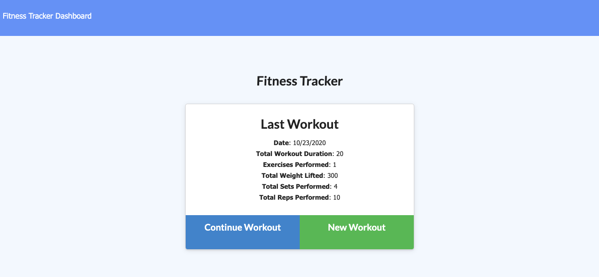
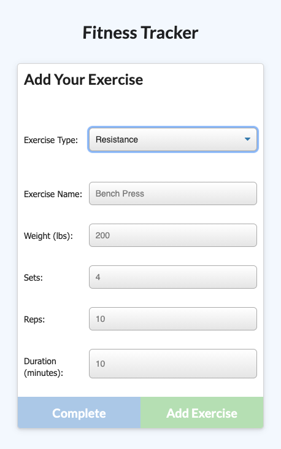
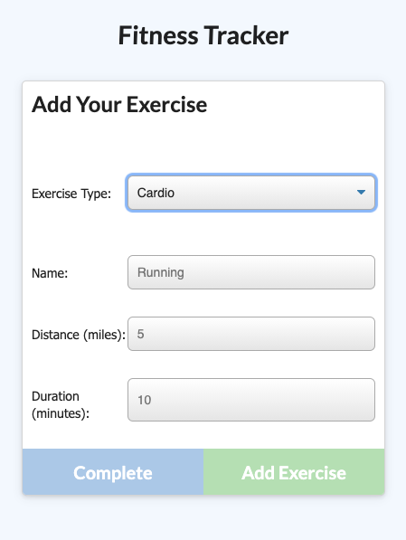
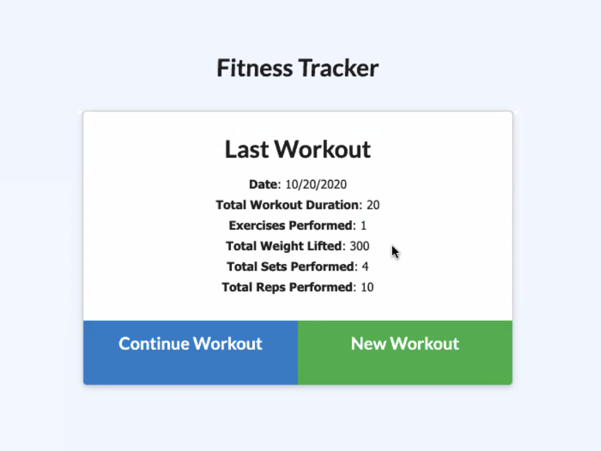
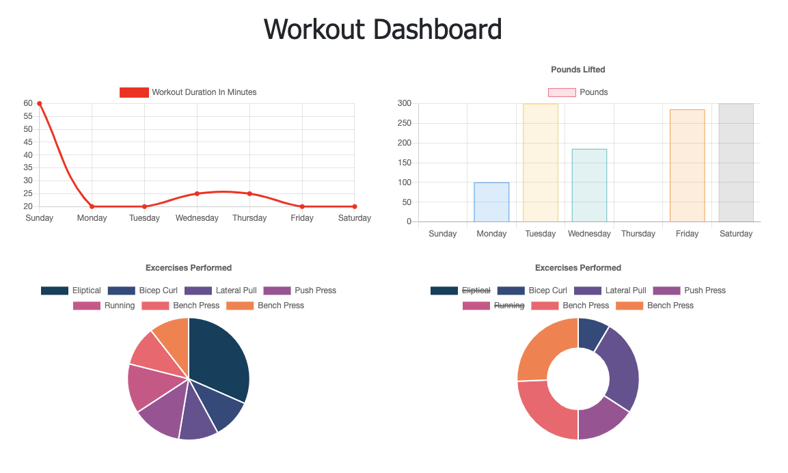

# Workout Tracker

[Deployed Workout Tracker!](https://workout-track-8000.herokuapp.com/)

## Description

This application tracks a users workout information and provides graphs to track their progress.

## User Story

As a user, I want to be able to view create and track daily workouts. I want to be able to log multiple exercises in a workout on a given day. I should also be able to track the name, type, weight, sets, reps, and duration of exercise. If the exercise is a cardio exercise, I should be able to track my distance traveled.

## Usage

When the user navigates to the site they will find the workout tracker.

When selecting "New Workout" the user is given an option between choosing "Resistance" or "Cardio" and then will need to fill out the relevant information about their workout. They can also choose to "Continue Workout" and add more information to the current workout they are completing.

After returning to the main page, the user will see the information of the last workout displayed on the screen.

If the user would like more information about past workouts they can navigate to the "dashboard" found on the top left of the page. There they will find various graphs detailing their workout history.

## Contributions

When contributing to this repository, please contact the owner of the repository before pushing any updates.
When contributions are accepted, please update the readme.md noting any changes that have been made.

## Authors and Acknowledgment

All files for this project were adapted and written by Raleigh Chesney based on files provided by GA Tech Coding Boot Camp.

NPMs:
* [Express](https://www.npmjs.com/package/express)
* [Mongoose](https://www.npmjs.com/package/mongoose)
* [Morgan](https://www.npmjs.com/package/morgan)

Hosting:
* [Heroku](https://www.heroku.com/home)
* [MongoDB](https://www.mongodb.com/)

Web Dev Tools:
* [Mozille Developer Network](https://developer.mozilla.org/en-US/)
* [Stack Overflow](https://stackoverflow.com/)
* [w3schools!](https://www.w3schools.com/bootstrap4/default.asp)

Thank you to all of my GT Bootcamp classmates who have offered advice and helped fix bugs alone the way.

## License

MIT License

Copyright (c) 2020 Raleigh Chesney

Permission is hereby granted, free of charge, to any person obtaining a copy
of this software and associated documentation files (the "Software"), to deal
in the Software without restriction, including without limitation the rights
to use, copy, modify, merge, publish, distribute, sublicense, and/or sell
copies of the Software, and to permit persons to whom the Software is
furnished to do so, subject to the following conditions:

The above copyright notice and this permission notice shall be included in all
copies or substantial portions of the Software.

THE SOFTWARE IS PROVIDED "AS IS", WITHOUT WARRANTY OF ANY KIND, EXPRESS OR
IMPLIED, INCLUDING BUT NOT LIMITED TO THE WARRANTIES OF MERCHANTABILITY,
FITNESS FOR A PARTICULAR PURPOSE AND NONINFRINGEMENT. IN NO EVENT SHALL THE
AUTHORS OR COPYRIGHT HOLDERS BE LIABLE FOR ANY CLAIM, DAMAGES OR OTHER
LIABILITY, WHETHER IN AN ACTION OF CONTRACT, TORT OR OTHERWISE, ARISING FROM,
OUT OF OR IN CONNECTION WITH THE SOFTWARE OR THE USE OR OTHER DEALINGS IN THE
SOFTWARE.